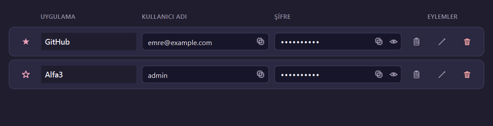
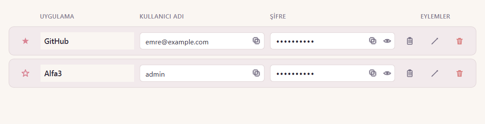

# Keyora

Yerel, tamamen çevrimdışı çalışan masaüstü parola yöneticisi. Python + PySide6 + SQLite. Şifreler Argon2id ile türetilen anahtarla Fernet (AES-128-CBC + HMAC-SHA256) altında saklanır. Hiçbir veri internete gitmez.




## Öne çıkanlar

- **Kart tabanlı arayüz** — her kayıt için kolonlu görünüm: uygulama, kullanıcı adı, şifre, eylemler
- **Alan içi ikonlar** — kullanıcı adı kutusunda kopya simgesi; şifre kutusunda göz (göster/gizle, 10 sn sonra otomatik maskele) ve kopya
- **Pano (geçmiş) butonu** — kayıt başına son 5 şifre versiyonu
- **Tema** — pastel **Koyu** ve pastel **Açık**, ayarlardan anında geçiş
- **Şifre üreteci** — `secrets` modülü ile kriptografik güvenli üretim, ayrı Ctrl+G penceresi veya kayıt düzenlerken inline panel
- **Auto-lock** — kullanıcı boştayken vault otomatik kilitlenir; süre ayarlanabilir
- **CSV import / export** — export öncesi master password tekrar sorulur; düz metin riski hakkında uyarı verilir
- **Master password değişimi** — tüm kayıtlar + history yeni anahtarla atomik şekilde yeniden şifrelenir
- **Tek dosya Windows exe** — PyInstaller ile `dist\Keyora.exe`

## Güvenlik mimarisi

```
Master Password
    │
    ├─► Argon2id(salt_verify, t=3, m=64 MB) → password_hash   [DB'ye yazılır, doğrulama]
    │
    └─► Argon2id(salt_key,    t=3, m=64 MB) → 32 byte raw key → Fernet key   [sadece bellekte]
```

- `salt_verify` ve `salt_key` birbirinden bağımsız `os.urandom(16)` ile üretilir
- Fernet anahtarı vault açıkken bellekte tutulur, DB'ye **hiçbir zaman** yazılmaz
- Vault kilitlenince anahtar referansı düşer
- Clipboard 20 sn sonra otomatik temizlenir
- Açıkta gösterilen şifre 10 sn sonra otomatik maskelenir

> **Uyarı:** Master password unutulursa hiçbir veri kurtarılamaz. Yedek tutmak kullanıcının sorumluluğundadır.

## Kurulum (geliştirme)

```bat
git clone <repo>
cd keyora
setup.bat
```

Veya manuel:

```bat
python -m venv venv
venv\Scripts\activate
pip install -r requirements.txt
python main.py
```

Gereksinim: Python 3.11+, Windows 10/11.

## Tek dosya exe üretimi

```bat
venv\Scripts\activate
pyinstaller keyora.spec --clean --noconfirm
```

Çıktı: `dist\Keyora.exe` (~50 MB, windowed, ikonlu, version info gömülü).

## Test

```bat
venv\Scripts\python -m pytest tests
```

Şu an 27 test (crypto, database, vault, password_gen, csv_io) — tamamı geçer.

## Dizin yapısı

```
keyora/
├── main.py                  # Giriş noktası — setup/login/main akışı
├── core/
│   ├── crypto.py            # Argon2 + Fernet (kilit altında — crypto-guard onayı gerekir)
│   ├── database.py          # SQLite şema + CRUD + rekey
│   └── vault.py             # Session, kilit, master password değişimi
├── ui/
│   ├── main_window.py       # Ana pencere, kolon başlıkları, kart akışı
│   ├── login_dialog.py      # Master password girişi (5 deneme limiti)
│   ├── setup_dialog.py      # İlk kurulum
│   ├── entry_dialog.py      # Kayıt ekle / düzenle + generator paneli
│   ├── settings_dialog.py   # Tema + auto-lock + master pw değişimi
│   ├── history_dialog.py    # Son 5 şifre versiyonu
│   ├── generator_dialog.py  # Bağımsız şifre üreteci
│   ├── about_dialog.py      # Sürüm + güvenlik notu
│   ├── theme.py             # Pastel Dark + pastel Light paletleri
│   ├── icons.py             # Kodla çizilen vektör ikon seti
│   └── components/
│       └── entry_card.py    # Tek satırlık kayıt kartı
├── utils/
│   ├── password_gen.py      # secrets ile üretici + güç tahmini
│   ├── clipboard.py         # QClipboard + 20 sn temizleme
│   └── csv_io.py            # CSV import / export
├── resources/
│   ├── keyora.ico           # Windows uygulama ikonu (16-256 px)
│   ├── keyora.png           # Pencere ikonu
│   ├── version_info.txt     # PE metadata
│   └── preview-*.png        # README görselleri
├── tools/
│   ├── make_icon.py         # İkon üretici
│   └── preview_card.py      # Tema önizleme render'ı
├── tests/                   # pytest test paketi
├── keyora.spec              # PyInstaller spec (commit edilir)
├── requirements.txt
├── setup.bat
└── README.md
```

## Veri konumu

Vault tek bir SQLite dosyasında saklanır:

| Platform | Konum |
|---|---|
| Windows | `%LOCALAPPDATA%\Keyora\keyora.db` (örn. `C:\Users\<sen>\AppData\Local\Keyora\keyora.db`) |
| macOS | `~/Library/Application Support/Keyora/keyora.db` |
| Linux | `$XDG_DATA_HOME/Keyora/keyora.db` (ya da `~/.local/share/Keyora/keyora.db`) |

- Uygulamadan çıksan da, bilgisayarı kapatıp açsan da veri kalıcıdır.
- Yedek almak için bu dosyayı kopyalaman yeterli — yine de şifreli durumdadır, master password olmadan açılamaz.
- Installer ile kaldırıldığında **vault dosyası silinmez**; tam temizlik için yukarıdaki dizini manuel sil.
- Dev/test sırasında DB konumunu geçersiz kılmak için `KEYORA_DB_PATH` ortam değişkenini kullan.

## Sürüm

1.0.0 — ilk yayın
